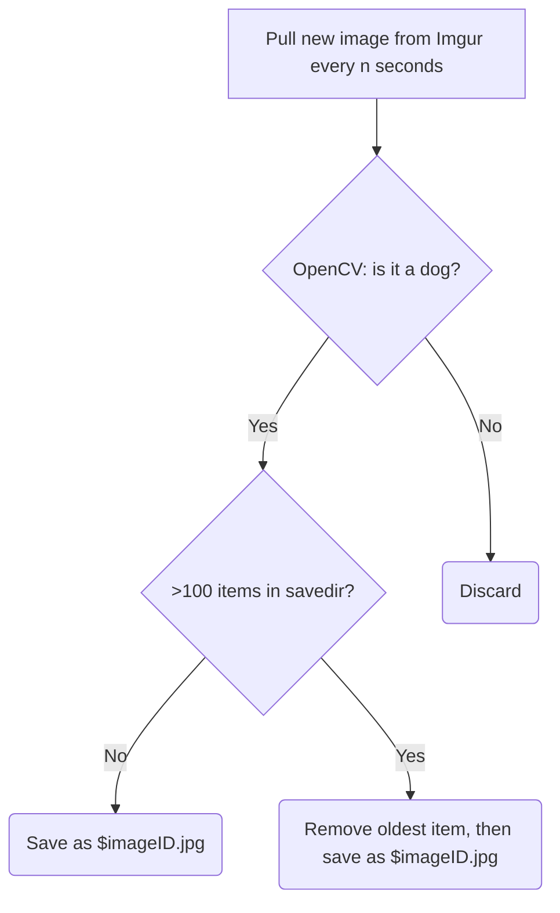
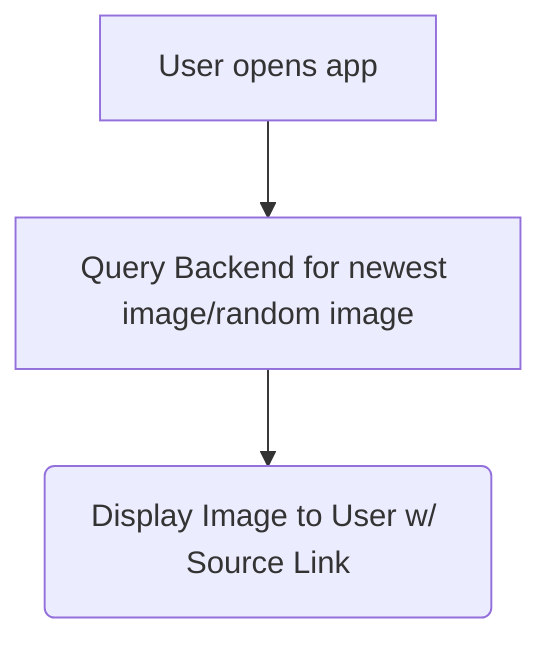

# DOGPICS

Welcome to DOGPICS, an app that displays pictures of dogs.  

## Flowchart

Backend:

```mermaid
graph TD
A[Pull new image from Imgur every n seconds]  --> B{OpenCV: is it a dog?}
B -- Yes --> C{>100 items in savedir?} 
C -- No --> D(Save as $imageID.jpg)
C -- Yes --> E(Remove oldest item, then save as $imageID.jpg)
B -- No --> F(Discard)

```

Frontend:

```mermaid
graph TD
A[User opens app]  --> B[Query Backend for newest image/random image]
B --> C(Display Image to User w/ Source Link)


```

